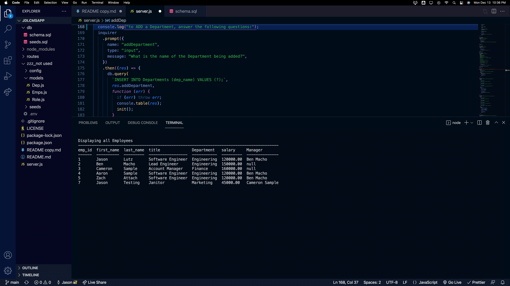

# JDLCMSApp

[]

## Table of Contents

- [Description](#description)
- [Technologies Used](#technologies-used)
- [Demonstration](#demonstration)
- [Setup](#setup)
- [Usage](#usage)
- [Project Updates](#project-updates)
- [Project Status](#project-status)
- [Have any Questions](#questions)
- [License](#license)

## Project Status

#### The status of Project JDL CMSApp is currently:

- ##### _complete_
- ###### The reason: NVP met

## Project Updates

figlet formatting for a better UX

## Demonstration

Live demo [_here_](https://drive.google.com/file/d/11ma49Kca7Nrx3BbzvxeteajXf-dGwxwT/view?usp=sharing).

## Description

- A node.js driven Content Management System used to Create, Update, and Delete your Employees Roles and Departments.

## Technologies Used

- console.table, figlet, inquirer, and mysql2

## Setup

To use this application, you must have the following technologies installed:

- console.table, figlet, inquirer and mysql2

## Usage

- view the package.json and run npm i to install libraries not notive to your terminal.

## Questions

This application was created by: 

- I encourage you to [send me an email](mailto:Jason.Lutz@du.edu)
  if you have any questions or comments.

## Contributors

Thank you to these GitHub users for thier contributions:

- https://github.com/LutzJason92

## License

- This appplication is currently using a mit license.
